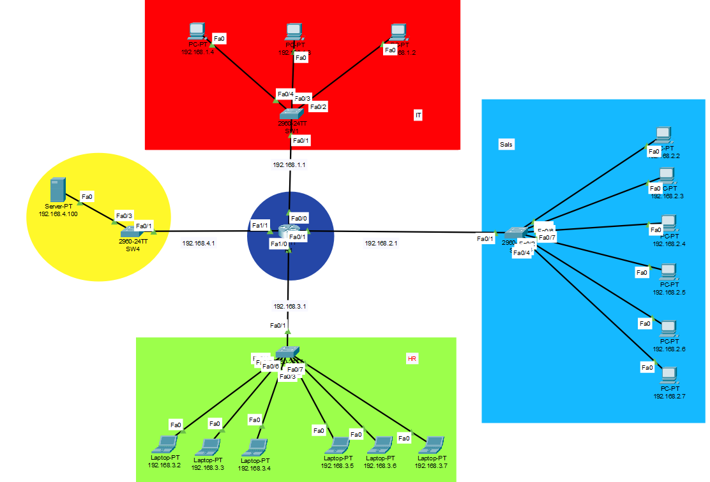

# Secure Local Enterprise Network Design (Cisco Packet Tracer)

A comprehensive and well-structured Local Area Network (LAN) architecture designed and simulated using **Cisco Packet Tracer**. This project demonstrates practical implementation of enterprise network concepts, including multi-service servers, inter-department connectivity, and professional physical workspace planning.

---

## 📐 Network Topologies & Architecture

### 1. Logical Topology
The logical design connects end-devices across multiple departments via a central switch, managed by a core router to route traffic and serve core network protocols.

### 2. Physical Layout & Connections
A realistic representation of office planning, showing how cables and network devices are structurally placed across different rooms and office areas.

| Office Layout Planning | Inter-Room Wiring Configuration |
|-----------------------|---------------------------------|
|  |  |

---

## 🛠️ Implemented Features & Core Protocols

* **Secure Web Hosting (HTTPS):** Configured a central Web Server to host websites securely over port 443, ensuring encrypted data communication.
* **Domain Name System (DNS):** Mapped user-friendly domain names to server IP addresses for seamless resource browsing.
* **Dynamic Host Configuration Protocol (DHCP):** Automates IP address assignment, subnet masks, gateways, and DNS settings for all client workstations dynamically.
* **Core Routing Configuration:** Properly configured gateway interfaces on the corporate router to establish baseline routing.

---

## 🔍 Verification & Testing Documentation

### 1. Router Interface Verification
Active configuration checking to verify that interface IPs are correctly assigned and operating in an `UP` status.

### 2. HTTPs Service Validation
Demonstrating a successful client-side connection to the secure server via the integrated web browser using domain resolution.

### 3. Cross-Department Connectivity (Ping Test)
End-to-end communication check confirming successful ICMP echo requests (Ping) between the **Sales** and **HR** workstations, proving functional network layer access.

---

## 🚀 How to Run the Simulation

1. Download and install **Cisco Packet Tracer** (v8.0 or higher recommended).
2. Clone this repository or download the `Project1.pkt` file.
3. Open `Project1.pkt` inside Packet Tracer.
4. Go to any PC, open the **Web Browser** application, type the configured domain name, and verify the secure HTTPS connection.
5. Open the command prompt on any PC and try pinging other devices to verify cross-network connectivity.
